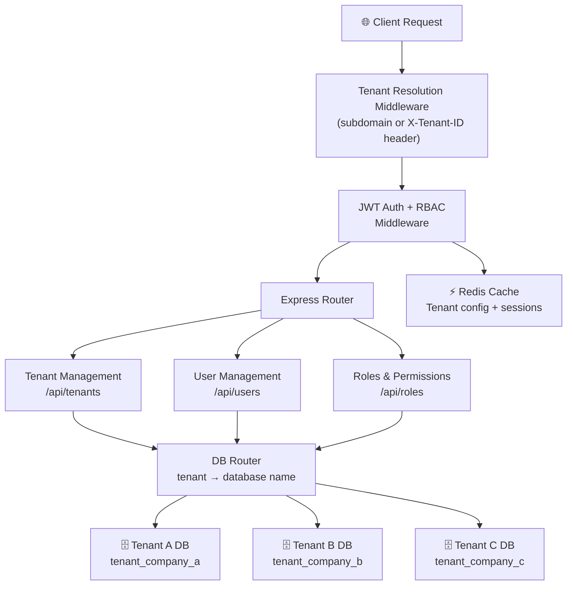
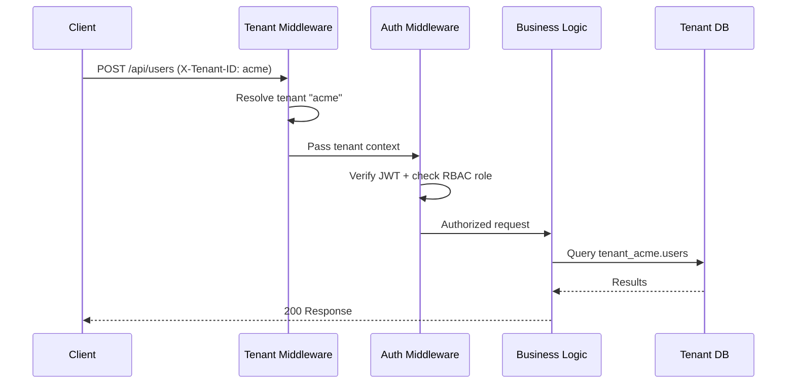

# 🏢 Multi-Tenant SaaS API

<p align="center">
  
  
  
  
  
  
  
</p>

A production-ready **multi-tenant SaaS API** built with Node.js, Express, and MongoDB. Each tenant gets a fully isolated database, scoped roles and permissions, and their own configuration — zero data leakage between tenants.

---

## ✨ Features

### 🔐 Multi-Tenancy
- **Database-per-tenant isolation** — each tenant has a dedicated MongoDB database
- **Tenant-aware routing** — automatic tenant resolution from subdomain or `X-Tenant-ID` header
- **Cross-tenant security** — middleware enforces strict isolation at every layer

### 🛡️ Security & Auth
- **JWT authentication** — stateless, signed tokens
- **Role-Based Access Control (RBAC)** — granular roles and permissions per tenant
- **Bcrypt** password hashing, Helmet headers, rate limiting, input sanitization

### 📊 Scalability
- **Redis caching** for frequently accessed tenant configs
- **Connection pooling** — efficient MongoDB connection management per tenant
- **Horizontal scaling** ready — stateless application layer

---

## 🏗️ Architecture



### Request Flow



---

## 🚀 Quick Start

```bash
git clone https://github.com/ahmadalsharef994/multi-tenant-saas-api.git
cd multi-tenant-saas-api
npm install
cp .env.example .env
npm run dev
```

---

## ⚙️ Configuration

```env
PORT=3000
NODE_ENV=development

MONGODB_URI=mongodb://localhost:27017/
DB_NAME_PREFIX=tenant_

JWT_SECRET=your_jwt_secret_here
JWT_EXPIRES_IN=24h

REDIS_URL=redis://localhost:6379   # optional
```

---

## 🌐 API Endpoints

### Auth
```
POST /api/auth/register    Register tenant user
POST /api/auth/login       Login (returns JWT)
POST /api/auth/refresh     Refresh token
POST /api/auth/logout
```

### Tenant Management *(admin only)*
```
GET    /api/tenants
POST   /api/tenants
GET    /api/tenants/:id
PUT    /api/tenants/:id
DELETE /api/tenants/:id
```

### User Management *(tenant-scoped)*
```
GET    /api/users
POST   /api/users
GET    /api/users/:id
PUT    /api/users/:id
DELETE /api/users/:id
```

### Roles & Permissions
```
GET    /api/roles
POST   /api/roles
PUT    /api/roles/:id
DELETE /api/roles/:id
```

---

## 📚 Usage Examples

### Create a tenant
```javascript
await fetch('/api/tenants', {
  method: 'POST',
  headers: {
    'Content-Type': 'application/json',
    'Authorization': 'Bearer ' + adminToken
  },
  body: JSON.stringify({
    name: 'Acme Corporation',
    domain: 'acme.yourapp.com',
    adminEmail: 'admin@acme.com'
  })
});
```

### Authenticate as a tenant user
```javascript
await fetch('/api/auth/login', {
  method: 'POST',
  headers: {
    'Content-Type': 'application/json',
    'X-Tenant-ID': 'acme-corp'
  },
  body: JSON.stringify({ email: 'user@acme.com', password: 'securepassword' })
});
```

---

## 🔧 Development

```bash
npm test              # Run all tests
npm run test:coverage # Coverage report
npm run lint          # ESLint
npm run format        # Prettier
```

---

## 🚀 Docker Deployment

```bash
docker build -t multi-tenant-api .
docker run -p 3000:3000 multi-tenant-api
```

---

## 📄 License

MIT — Built for enterprise-grade multi-tenant applications 🏢
